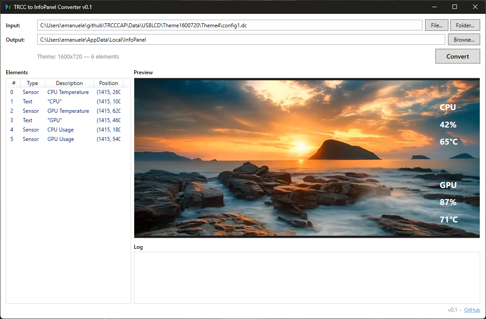

# TRCC to InfoPanel Theme Converter

Converts [TRCC](https://github.com/emaspa/TRCCCAP) (Thermalright) LCD theme files (`config1.dc`) to [InfoPanel](https://github.com/habibrehmansg/infopanel) profile format (XML).

If you own a Thermalright LCD panel (like the FC140 or similar) and want to use your existing TRCC themes in InfoPanel, this tool does the conversion automatically — preserving layout, fonts, colors, sensor bindings, and background images.



## Downloads

Grab the latest release from the [Releases page](https://github.com/emaspa/trcctoinfopanel/releases/latest):

| File | Description |
|------|-------------|
| `TrccToInfoPanel.exe` | GUI app — visual theme preview, drag-and-drop, batch conversion |
| `TrccToInfoPanel.Cli.exe` | CLI tool — for scripting and automation |
| `app.ico` | App icon — place next to the GUI exe |

Both are self-contained Windows x64 binaries. No .NET SDK required to run.

## Features

- **Both TRCC formats supported** — format 221 (0xDD, current) and legacy format 220 (0xDC)
- **Visual theme preview** — see the converted layout with background image and positioned elements before converting
- **Drag-and-drop** — drop a file or folder onto the GUI window
- **Auto-detection** — automatically determines single theme, all themes, or batch mode based on input path
- **Background images** — copies `00.png`, `01.png`, `Theme.png` to InfoPanel assets directory
- **All resolutions** — supports every TRCC screen size from 240x240 to 1920x462
- **Batch conversion** — convert hundreds of themes in one click

## How it works

TRCC stores themes as binary `.dc` files with sensor overlays, clocks, dates, and text labels positioned over a background image. This tool parses those files and generates InfoPanel-compatible XML profiles with the same layout, fonts, colors, and sensor bindings.

### Element mapping

| TRCC Element | InfoPanel Element | Notes |
|---|---|---|
| Sensor data (CPU/GPU/Memory/HDD/Network/Fan) | `SensorDisplayItem` | Placeholder LibreHardwareMonitor sensor IDs — reassign in InfoPanel to match your hardware |
| Time display | `ClockDisplayItem` | 12h/24h format preserved |
| Day of week | `CalendarDisplayItem` | `dddd` format |
| Date display | `CalendarDisplayItem` | Date format preserved (yyyy/MM/dd, dd/MM/yyyy, etc.) |
| Custom text | `TextDisplayItem` | Text content and styling preserved |
| Image/icon | `ImageDisplayItem` | |
| Background (00.png, 01.png) | `ImageDisplayItem` | Copied to assets directory |

Font names (Chinese to English mapping), colors (ARGB), positions, bold/italic styles are all preserved.

## GUI Usage

1. Launch `TrccToInfoPanel.exe`
2. Click **File...** or **Folder...** to select a theme, or drag-and-drop onto the window
3. The preview panel shows how the theme will look with placeholder sensor values
4. The elements panel lists each item with its type, description, and position
5. Adjust the output directory if needed (defaults to `%LOCALAPPDATA%\InfoPanel`)
6. Click **Convert**
7. Restart InfoPanel — converted profiles will appear after restart

### Input modes

The tool auto-detects what you selected:

| Input | Mode | Description |
|---|---|---|
| `config1.dc` file | Single | Converts one theme |
| Theme directory (e.g., `Theme1/`) | Single | Finds and converts `config1.dc` inside |
| Resolution directory (e.g., `Theme800480/`) | All | Converts all Theme1-5 in that folder |
| USBLCD root directory | Batch | Converts every theme across all resolutions |

## CLI Usage

```
TrccToInfoPanel.Cli <input> [options]
```

### Convert a single theme

```bash
TrccToInfoPanel.Cli C:\TRCCCAP\Data\USBLCD\Theme800480\Theme1\config1.dc
TrccToInfoPanel.Cli C:\TRCCCAP\Data\USBLCD\Theme800480\Theme1
```

### Convert all themes in a resolution folder

```bash
TrccToInfoPanel.Cli C:\TRCCCAP\Data\USBLCD\Theme800480 --all
```

### Batch convert everything

```bash
TrccToInfoPanel.Cli --batch C:\TRCCCAP\Data\USBLCD
```

### Inspect a theme without converting

```bash
TrccToInfoPanel.Cli C:\TRCCCAP\Data\USBLCD\Theme800480\Theme1 --dump
```

Example output:

```
  Canvas:     800x480
  SysInfo:    True
  Background: True
  Direction:  0°
  Elements:   7

  [0] Mode=4: Text: "CPU"
      Pos=(103,310) Font="微软雅黑" Size=36 Color=#FFFFFFFF
  [1] Mode=0: Sensor (main=0, sub=1)
      Pos=(103,370) Font="微软雅黑" Size=36 Color=#FFFFFFFF
  [2] Mode=0: Sensor (main=0, sub=2)
      Pos=(343,370) Font="微软雅黑" Size=36 Color=#FFFFFFFF
  ...
```

### CLI Options

| Option | Description |
|---|---|
| `-o, --output <dir>` | Output directory (default: `./output`) |
| `--all` | Convert all Theme1-5 in a resolution folder |
| `--batch` | Convert everything under a USBLCD directory |
| `--dump` | Dump parsed theme info without converting |

## Output structure

The converter produces files matching InfoPanel's expected layout:

```
output/
├── profiles.xml                        # Profile metadata (resolution, name, colors)
├── profiles/
│   └── {guid}.xml                      # Display items (sensors, text, clocks, images)
└── assets/
    └── {guid}/
        ├── 00.png                      # Background image
        ├── 01.png                      # Alternate image
        └── Theme.png                   # Theme preview
```

The GUI defaults output to `%LOCALAPPDATA%\InfoPanel\` so converted profiles are written directly to InfoPanel's data directory. The CLI defaults to `./output` — copy its contents into InfoPanel's data directory to use them.

**Note:** InfoPanel must be restarted for converted profiles to appear. It only reads profiles from disk at startup.

## Supported resolutions

172x640, 240x240, 240x320, 320x240, 320x320, 320x960, 360x360, 480x480, 480x640, 480x800, 480x854, 480x1280, 540x960, 640x172, 640x480, 720x1600, 800x480, 854x480, 960x320, 960x540, 440x1920, 462x1920, 1280x480, 1600x720, 1920x440, 1920x462

## Building from source

Requires .NET 8.0 SDK or later.

```bash
# Build everything
dotnet build

# Run the GUI
dotnet run --project TrccToInfoPanel.Wpf

# Run the CLI
dotnet run --project TrccToInfoPanel -- <args>

# Publish self-contained binaries
dotnet publish TrccToInfoPanel.Wpf -c Release -r win-x64 --self-contained -p:PublishSingleFile=true -o ./publish/gui
dotnet publish TrccToInfoPanel -c Release -r win-x64 --self-contained -p:PublishSingleFile=true -o ./publish/cli
```

### Project structure

```
TrccToInfoPanel.sln
├── TrccToInfoPanel.Core/       # Shared library: models, binary reader, converter, XML writer
├── TrccToInfoPanel/            # CLI console app
└── TrccToInfoPanel.Wpf/        # WPF GUI app
```

## Limitations

- Sensor IDs are placeholders (Intel CPU / NVIDIA GPU defaults via LibreHardwareMonitor). You must reassign sensors in InfoPanel to match your actual hardware after importing.
- TRCC image elements that reference .NET assembly resources cannot be extracted automatically.
- Windows only (WPF GUI and System.Drawing dependency).

## License

MIT
